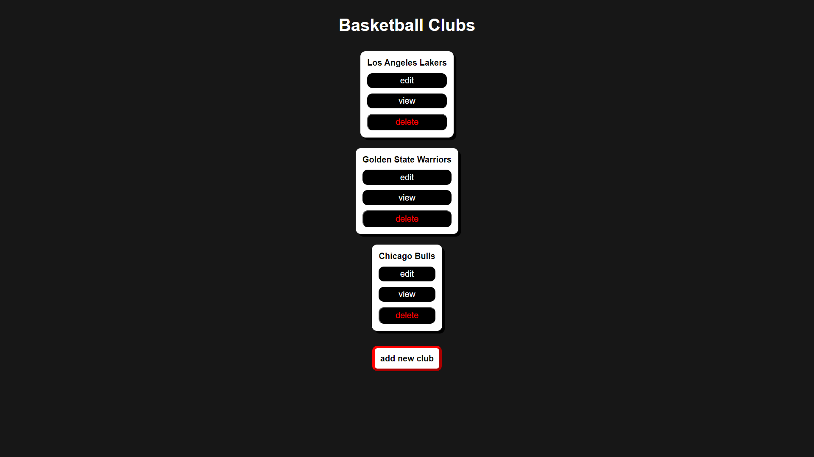

# Basketball League

Web application for browsing and managing basketball teams and players belonging to them.

## Description
The main idea of the app is to create your own basketball league with teams and players of your own choice.

#### Tech
The backend of the application uses microservices for players and basketball clubs management written in Java with the usage of Spring framework. Data is being stored in a PostgreSQL database. Communication between services is performed with REST API and request are being controlled by a gateway written also in Java with Spring framework. 

The frontend of the application is written in Angular with the usage of Node.js and nginx.

All the applications are bound and ran together using Docker. 

## Getting started
#### Requirements
Before running the project those things are needed:
- JDK
- environmental variable set as `JAVA_HOME` with path to the installed JDK
- Angular - version 16.0.1
- Node.js
- Docker

#### Setup
How to run this project:
1. Clone this repository:
```bash
git clone https://github.com/kalinovsk1/basketball-league-app.git
cd basketball-league-app
```
2. Run the project:
```
docker-compose up
```
3. Open the project at `localhost:8087` in your web browser


## How to use
User can perform different operations for each class:
- basketball club:
    - `delete` - delete an existing team
    - `view` - show information about the name, year of foundation and players belonging to the club
    - `edit` - change existing information about the organization
    - `add new club` - create a new basketball team
- player:
    - `delete` - delete an existing player
    - `view` - show information about players name and height
    - `edit` - edit information about a player
    - `add new player` - create a new player that will belong to a certain club

 ## Screenshots
 
 
 
